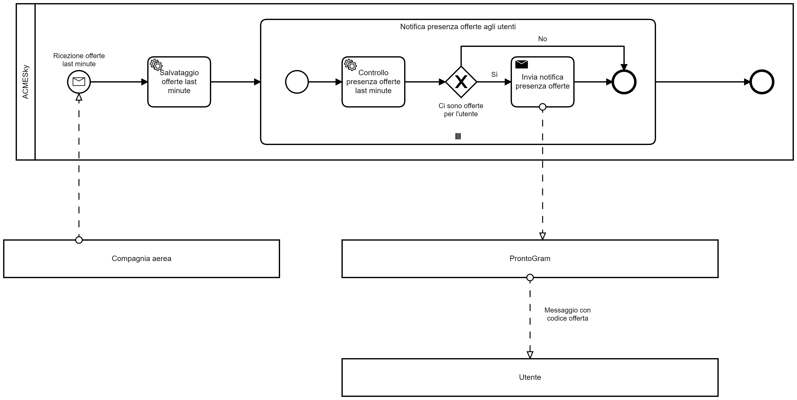

---
hide:
  - navigation
---

In questa sezione vengono rappresentati sotto forma di diagrammi BPMN le coreografie discusse nella [sezione precedente](coreografie.md). I seguenti diagrammi sono solo a scopo documentativo di conseguenza il loro livello di dettaglio è finalizzato a questo fine. Infatti abbiamo tralasciato la maggior parte della gestione degli errori che viene discussa nell'[implementazione](implementazione.md).

## Registrazione interesse di un utente
{: loading=lazy}

Il diagramma descrive il processo di registrazione nel Portale Web di ACMESky dell'interesse, da parte di utente, a un pacchetto di viaggio A/R, con un massimo budget e un range di date entro cui effettuare entrambe le tratte. Il processo inizia con la ricezione da parte di ACMESky di questi dati. Questi dati vengono memorizzati da ACMESky per i successivi controlli. Sia che l'operazione avvenga correttamente, sia che essa fallisca, viene comunicato all'utente l'esito di quest'ultima. Il processo può quindi terminare.

## Verifica giornaliera delle offerte
{: loading=lazy}

Il diagramma descrive il processo di verifica quotidiana della presenza di offerte che possano soddisfare gli interessi registrati degli utenti di ACMESky. Questo processo si avvia sistematicamente ogni 24 ore.

ACMESky contatta i servizi delle compagnie aeree, in modo parallelo, che inviano tutte le offerte a disposizione in quella giornata.

!!! info
    Ogni istanza del sotto-processo `Controllo offerte compagnie aeree` si riferisce a una differente compagnia aerea. Nel diagramma questo è modellato come se fosse un'unica compagnia poiché il modellatore *Camunda Modeler* non supporta *collapsed pool multi-instance*.

Ricevute le offerte del giorno di una compagnia aerea, vengono memorizzate per effettuare i successivi controlli. Quando sono terminate tutte le istanze del sotto-processo `Controllo offerte compagnie aeree`, il processo genitore può continuare nella sua esecuzione.

Per ogni interesse registrato da parte di un utente viene avviato, in parallelo, un'istanza del sotto-processo `Notifica presenza offerte agli utenti`, in cui viene verificata la presenza di una corrispondenza con un'offerta ricevuta da una compagnia aerea. In caso non venga trovata alcuna corrispondenza, il sotto-processo termina. Se invece viene trovata, ACMESky genera un codice offerta da inviare all'utente tramite ProntoGram: ACMESky invia il messaggio a ProntoGram, il quale si occuperà di inviarlo al client ProntoGram dell'utente.

Terminate tutte le istanze parallele di `Notifica presenza offerte agli utenti`, il processo termina.

## Ricezione offerte last minute
{: loading=lazy}

Il diagramma descrive il processo di ricezione da parte di ACMESky di un'offerta last minute di una compagnia aerea e la conseguente verifica della presenza di utenti che hanno segnalato il loro interesse verso quel tipo di offerta. Il processo si avvia automaticamente alla ricezione dell'offerta.

Quando ACMESky recepisce l'offerta, questa viene memorizzata per effettuare i successivi controlli.

Come nel diagramma del processo di **Verifica giornaliera delle offerte**, per ogni interesse registrato da parte di un utente viene avviato, in parallelo, un'istanza del sotto-processo `Notifica presenza offerte agli utenti`, in cui viene verificata la presenza di una corrispondenza con un'offerta ricevuta da una compagnia aerea. In caso non venga trovata alcuna corrispondenza, il sotto-processo termina. Se invece viene trovata, ACMESky genera un codice offerta da inviare all'utente tramite ProntoGram: ACMESky invia il messaggio a ProntoGram, il quale si occuperà di inviarlo al client ProntoGram dell'utente.

Terminate tutte le istanze parallele di `Notifica presenza offerte agli utenti`, il processo termina.

## Acquisto offerta da un utente
{: loading=lazy}

Il diagramma descrive il processo di acquisto di un offerta da parte di un utente.

Il processo inizia con la ricezione, attraverso il Portale Web di ACMESky, di un codice offerta. Ne viene immediatamente verificata la validità tramite un *Service Task* e, in caso il codice non sia valido, viene avvisato l'utente e il processo termina. Invece, nel caso sia valido, il processo prosegue facendo richiesta al Provider dei Pagamenti di richiedere il pagamento all'utente, il quale invia i dati per il pagamento al Provider dei Pagamenti che, una volta elaborati, invia l'esito della transazione ad ACMESky. In caso l'esito della transazione sia negativo, ACMESky comunica all'utente che c'è stato un problema con il pagamento e il processo termina; in caso di esito positivo il processo procede nell'esecuzione.

ACMESky acquista i biglietti aerei dell'offerta attraverso il servizio della Compagnia Aerea, la quale restituisce ad ACMESky i biglietti. In caso il prezzo totale dei viaggi superi i 1.000 € e il cliente viva entro 30 Km dall'aeroporto, ACMESky identifica la compagnia di trasporto con autista più vicina all'abitazione del cliente per prenotare il trasferimento da/verso l'aeroporto. Il calcolo delle distanze viene fatto tramite il servizio Distanze Geografiche.

Infine, ACMESky invia all'utente i biglietti aerei e, in caso sia stato prenotato, i biglietti per il trasferimento da/verso l'aeroporto. Il processo può quindi concludersi. 

