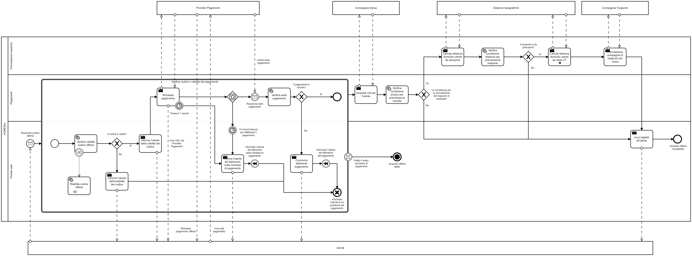

---
hide:
  - navigation
---

In questa sezione vengono rappresentati, sotto forma di diagrammi BPMN, le coreografie discusse nelle [Coreografie, ruoli e proiezioni delle coreografie sui ruoli](coreografie.md) e [BPMN](bpmn.md). Per ogni diagramma descriviamo prima il processo ad alto livello, ovvero a scopo documentativo, nel quale mostriamo principalmente il cosiddetto *happy path*; successivamente lo espandiamo aggiungendo la gestione degli errori, delle eccezioni e degli altri possibili fallimenti che potrebbero avvenire calando nella realtà il processo di business definito.

## Registrazione interesse di un utente

### Scopo documentativo
{: loading=lazy}

Il diagramma descrive il processo di registrazione dell'interesse nel portale web di *ACMESky*, da parte di utente, di un pacchetto di viaggio A/R, con un massimo budget e un range di date entro cui effettuare entrambe le tratte. Il processo inizia con la ricezione da parte di *ACMESky* di questi dati che vengono successivamente memorizzati da *ACMESky* per i successivi controlli. Sia che l'operazione avvenga correttamente, sia che essa fallisca, viene comunicato all'utente l'esito di quest'ultima. Il processo può quindi terminare.

### Scopo implementativo
Il diagramma con scopo implementativo non ha subito modifiche in quanto il processo non prevede la possibilità di fallimento (dal punto di vista del business process).

## Verifica giornaliera delle offerte

### Scopo documentativo
{: loading=lazy}

Il diagramma descrive il processo di verifica quotidiana della presenza di offerte che possano soddisfare gli interessi registrati degli utenti di *ACMESky*. Questo processo si avvia sistematicamente ogni 24 ore.

*ACMESky* contatta i servizi delle compagnie aeree, in modo parallelo, che inviano tutte le offerte a disposizione in quella giornata.

!!! info
    Ogni istanza del sotto-processo `Controllo offerte compagnie aeree` si riferisce a una differente compagnia aerea. Nel diagramma questo è modellato come se fosse un'unica compagnia poiché il modellatore *Camunda Modeler* non supporta *collapsed pool multi-instance*.

Ricevute le offerte del giorno di una compagnia aerea, vengono memorizzate per effettuare i successivi controlli. Quando sono terminate tutte le istanze del sotto-processo `Controllo offerte compagnie aeree`, il processo genitore può continuare nella sua esecuzione.

Per ogni utente che ha registrato uno o più interessi viene avviato, in parallelo, un'istanza del sotto-processo `Notifica presenza offerte agli utenti`, in cui viene verificata la presenza di una corrispondenza con offerte di voli ricevuti dalle compagnie aeree. In caso non venga trovata alcuna corrispondenza, il sotto-processo termina. Se invece viene trovata, *ACMESky* genera un codice offerta da inviare all'utente tramite ProntoGram: *ACMESky* invia il messaggio a *ProntoGram*, il quale si occuperà di inviarlo al client *ProntoGram* dell'utente.

Terminate tutte le istanze parallele di `Notifica presenza offerte agli utenti`, il processo termina.

### Scopo implementativo
{: loading=lazy}

Il processo in esame ha subito diverse modifiche per poterlo rendere robusto agli errori che potrebbero verificarsi durante l'esecuzione. In particolare:

- sono stati aggiunti dei **Timer Boundary Event** in quei task in cui viene contattato, attraverso la rete, un servizio esterno ad *ACMESky*: serve ad evitare che, in caso i servizi esterni non riescano ad elaborare la richiesta in tempi ragionevoli, il processo non rimanga altrettanto in stallo;
- dovendo memorizzare dei voli ottenuti da una *compagnia aerea*, il salvataggio potrebbe fallire nel caso il formato dei dati ricevuti sia diverso da quello atteso oppure se vengono ricevuti dati duplicati. In questi casi, l'istanza corrente del sotto-processo `Controllo offerte compagnie aeree` termina senza salvare le offerte di tale *compagnia aerea*;
- è stato aggiunto il task `Recupero interessi utenti` per poter recuperare dalla base di dati gli interessi degli utenti in modo da poterli memorizzare come variabili di Camunda e quindi poter istanziare i diversi sotto-processi `Notifica presenza offerte agli utenti`.

## Ricezione offerte last minute

### Scopo documentativo
{: loading=lazy}

Il diagramma descrive il processo di ricezione da parte di *ACMESky* di un'offerta last minute di una compagnia aerea e la conseguente verifica della presenza di utenti che hanno segnalato il loro interesse verso quel tipo di offerta. Il processo si avvia automaticamente alla ricezione dell'offerta.

Quando *ACMESky* recepisce l'offerta, questa viene memorizzata per effettuare i successivi controlli.

Come nel diagramma del processo di **Verifica giornaliera delle offerte**, per ogni utente che ha registrato uno o più interessi viene avviata, in parallelo, un'istanza del sotto-processo `Notifica presenza offerte agli utenti`, in cui viene verificata la presenza di una corrispondenza con offerte di voli ricevuti dalle compagnie aeree. In caso non venga trovata alcuna corrispondenza, il sotto-processo termina. Se invece viene trovata, *ACMESky* genera un codice offerta da inviare all'utente tramite ProntoGram: *ACMESky* invia il messaggio a ProntoGram, il quale si occuperà di inviarlo al client ProntoGram dell'utente.

Terminate tutte le istanze parallele di `Notifica presenza offerte agli utenti`, il processo termina.

### Scopo implementativo
{: loading=lazy}

Essendo molto simile al precedente business process descritto, anche quest'ultimo ha subito simili modifiche, per cui:

- è stato aggiunto un Timer Boundary Event nel task `Invia notifica presenza offerte`, che contatta ProntoGram: nel caso in cui il servizio contattato non fosse in grado di soddisfare la richiesta entro i tempi stabiliti, l'istanza del sotto-processo terminerebbe;
- dovendo memorizzare i voli ottenuti dalla compagnia aerea che ha contattato *ACMESky* e ha fatto avviare il processo, il salvataggio potrebbe fallire nel caso il formato dei dati ricevuti sia diverso da quello atteso oppure se vengono ricevuti dati duplicati. In questi casi, il processo fallirebbe nel suo intero;
- è stato aggiunto il task `Recupero interessi utenti` per poter recuperare dalla base di dati gli interessi degli utenti in modo da poterli memorizzare come variabili di Camunda e quindi poter istanziare i diversi sotto-processi `Notifica presenza offerte agli utenti`.

## Acquisto offerta da un utente

### Scopo documentativo
{: loading=lazy}

Il diagramma descrive il processo di acquisto di un offerta da parte di un utente.

Il processo inizia con la ricezione, attraverso il portale web di *ACMESky*, di un codice offerta e dei dati personali dell'utente (nome, cognome, indirizzo). Viene verificata la validità del codice tramite un **Service Task** e, in caso esso non sia valido, viene avvisato l'utente e il processo termina. Invece, nel caso sia valido, il processo prosegue facendo richiesta al *Provider dei Pagamenti* di richiedere il pagamento all'utente, il quale gli invia i dati per il pagamento. Quest'ultimo, una volta elaborati tali dati, invia l'esito della transazione ad *ACMESky*. In caso l'esito della transazione sia negativo, *ACMESky* comunica all'utente che c'è stato un problema con il pagamento e il processo termina; in caso di esito positivo il processo procede nell'esecuzione.

*ACMESky* acquista i biglietti aerei dell'offerta attraverso il servizio della *compagnia aerea*, la quale restituisce ad *ACMESky* i biglietti. In caso il prezzo totale dei viaggi superi i 1000 € e il cliente viva entro 30 Km dall'aeroporto, *ACMESky* identifica la *compagnia di trasporto* con autista più vicina all'abitazione del cliente per prenotare il trasferimento da/verso l'aeroporto. Il calcolo delle distanze viene fatto tramite il servizio *Distanze Geografiche*.

Infine, *ACMESky* invia all'utente i biglietti aerei e, in caso sia stato prenotato, i biglietti per il trasferimento da/verso l'aeroporto. Il processo può quindi concludersi. 

### Scopo implementativo
{: loading=lazy}

Il processo appena descritto ha subito numerose modifiche integrative nella sua prima metà, ovvero quella corrispondente agli step che portano dalla ricezione dei dati al pagamento dell'offerta e della sua conferma. Vengono elencati di seguito:

- è stato introdotto il **Transaction Sub-process** `Verifica codice e validità del pagamento` che racchiude tutti i task relativi alla verifica del codice offerta inserito e del pagamento. Nel caso di fallimento del sotto-processo, anche il processo genitore termina, non prima però di aver ripristinato lo stato del sistema riabilitando il codice dell'offerta (che torna utilizzabile) attraverso la **Compensating action** `Riabilita codice offerta`;
- è stato inserito, come nei precedenti diagrammi, un Timer Boundary Event, per gestire il caso in cui il *Provider dei Pagamenti* non risponda nei tempi previsti;
- è stato inserito, successivamente all'invio della richiesta di pagamento al *Provider dei Pagamenti* da parte di *ACMESky*, un **Event-based gateway** con lo scopo di ricevere o la ricezione dell'esito del pagamento da parte del gestore dei pagamenti oppure della scadenza di un timeout nel caso in cui l'utente non paghi entro 10 minuti.