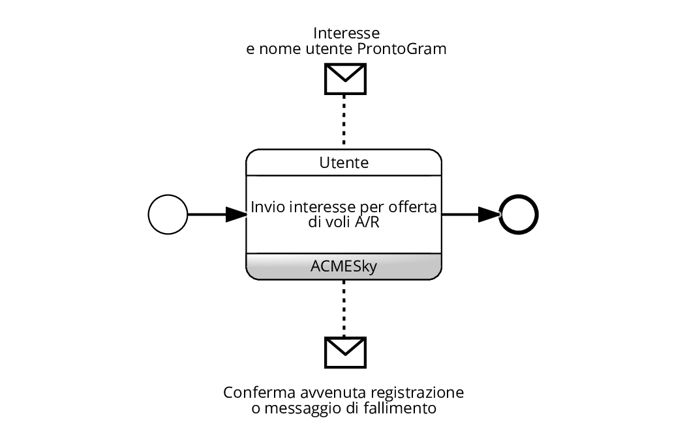
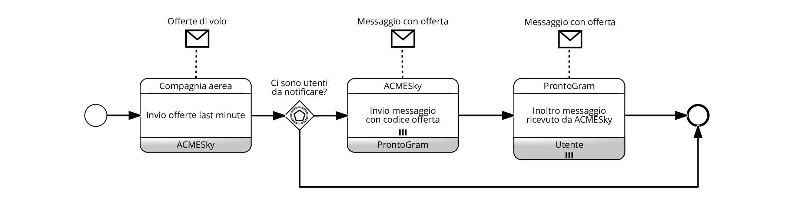
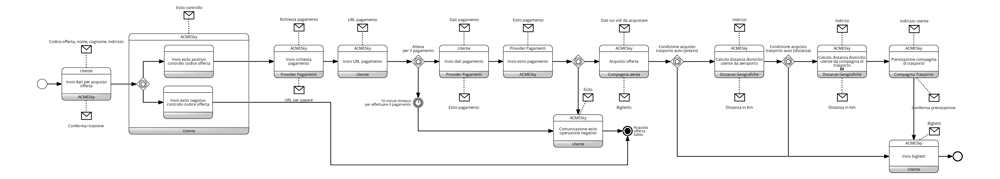

---
hide:
  - navigation
---

## Registrazione interesse di un utente
{: loading=lazy}

Il diagramma descrive l'interazione fra un utente e *ACMESky* per l'inserimento nel sistema di un nuovo interesse per un offerta di voli A/R.

Oltre ai dati sull'interesse inserisce anche il suo nome utente di *ProntoGram*. Sia in caso l'interesse venga aggiunto correttamente che in caso contrario *ACMESky* risponde con l'esito dell'operazione.

## Verifica giornaliera delle offerte
{: loading=lazy}

Il diagramma descrive le interazioni che avvengono fra *ACMESky*, le *compagnie aeree*, *ProntoGram* e gli utenti, nel contesto della verifica giornaliera della presenza di nuove offerte da comunicare all'utente.

Ogni 24 ore, *ACMESky* contatta le differenti *compagnie aeree* richiedendo la lista delle nuove offerte inserite. Una volta ricevute, *ACMESky* verifica se ci sono utenti da notificare in quanto le offerte ricevute soddisfano i loro interessi: in caso affermativo, *ACMESky* contatta *ProntoGram* inviando il messaggio da far pervenire all'utente (con il codice offerta per il successivo acquisto); in caso negativo, non vi sono altre interazioni. *ProntoGram*, alla ricezione della richiesta di inoltro di un messaggio agli utenti, la soddisfa.

## Ricezione offerte last minute
{: loading=lazy}

Il diagramma descrive le interazioni che avvengono fra una *compagnia aerea*, *ACMESky*, *ProntoGram* e gli utenti, nel contesto dell'invio di offerte last minute da parte di una *compagnia aerea*.

Quando una *compagnia aerea* dispone di offerte last minute, contatta *ACMESky* inviandole. Una volta ricevute tali offerte, *ACMESky* verifica se ci sono utenti da notificare in quanto le offerte ricevute soddisfano i loro interessi: in caso affermativo, *ACMESky* contatta *ProntoGram* inviando il messaggio da far pervenire all'utente (con il codice offerta per il successivo acquisto); in caso negativo, non vi sono altre interazioni. *ProntoGram*, alla ricezione della richiesta di inoltro di un messaggio agli utenti, la soddisfa.

## Acquisto offerta da un utente
{: loading=lazy}

Il diagramma descrive le interazioni tra i diversi partecipanti che portano al pagamento dell'offerta, il cui codice è stato inviato precedentemente all'utente, e il successivo invio dei biglietti relativi.

Quando un utente invia ad *ACMESky* il codice dell'offerta, il proprio nome e cognome e il proprio indirizzo, viene avviato il processo di acquisto.  
Come prima cosa, *ACMESky* verifica la validità del codice offerta ricevuto: infatti, se questo risultasse errato, già utilizzato oppure scaduto, l'utente verrebbe avvisato dell'impossibilità di proseguire; nel caso fosse valido, verrebbe dapprima informato e successivamente inoltrata la richiesta di pagamento al *Provider dei Pagamenti*.  
Il *Provider di Pagamenti* risponde alla richiesta di pagamento con un riferimento, al quale l'utente deve accedere, per poter pagare.  
*ACMESky*, ricevuto tale riferimento, lo inoltra all'utente il quale ha un tempo massimo di 10 minuti per portare a termine l'operazione di pagamento. Qualsiasi sia l'esito dell'operazione, il *Provider dei Pagamenti* lo comunica ad *ACMESky*. Nel caso in cui l'utente non completi entro il tempo previsto il pagamento oppure l'esito risulti negativo, viene notificato il problema e il processo termina.

Con il pagamento effettuato correttamente, il processo può proseguire. *ACMESky* contatta la compagnia aerea, i cui voli fan parte dell'offerta inviata all'utente, per poterli acquistare.  
Nel caso in cui il prezzo dell'offerta superi i 1000 € e l'utente abbia dichiarato un indirizzo entro i 30 Km dall'aeroporto di partenza (distanza calcolata tramite interazione con *Distanze Geografiche*), allora *ACMESky* identifica la *compagnia di trasporto* più vicina a tale indirizzo (contattando nuovamente Distanze Geografiche) e prenotando da questa il trasporto da/verso l'aeroporto.  
In ogni caso, *ACMESky* invia all'utente i biglietti dei voli e, se è stata prenotata una *compagnia di trasporto*, anche i biglietti per quest'ultima.