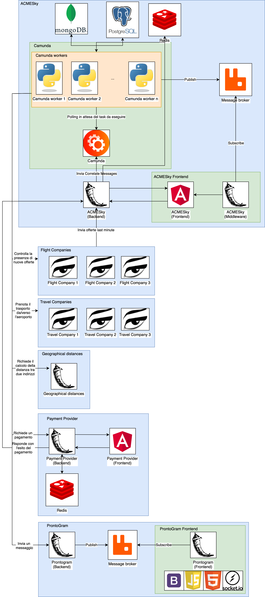

---
hide:
  - toc
---
# Implementazione

In questa sezione vengono presentate le scelte implementative effettuate per la realizzazione dei servizi presenti in questo sistema.

## Diagramma architetturale
{: loading=lazy}

Il diagramma descrive come i diversi servizi comunicano tra loro e quali tecnologie abbiamo adottato per implementarli.

- *ACMESky*: questo ruolo è formato da molteplici componenti: 
    - *Camunda BPMN Engine* nel quale sono stati caricati i diagrammi BPMN descritti nella [sezione precedente](bpmn.md). Si occupa di gestire i Business Process, viene contattato dai _camunda workers_ per eseguire i diversi task.
    - *Camunda Workers*: insieme di funzioni scritte in Python con l'ausilio della libreria [camunda-external-task-client-python3](https://github.com/yogeshrnaik/camunda-external-task-client-python3) che eseguono i task dichiarati nei diagrammi BPMN; in base al task da eseguire il _worker_ può comunicare con il database relazionale PostgreSQL, il database NoSQL MongoDB o il message broker RabbitMQ, ma anche con servizi esterni ad ACMESky come il PaymentProvider, ProntoGram, le compagnie aeree e di trasporto e il servizio per il calcolo delle distanze geografiche. Esiste un _worker_ per ogni task presente nei diagrammi BPMN; questa soluzione è stata adottata per avere maggior chiarezza e semplicità nella gestione dei diversi task.
    - *PostgreSQL*: database relazionale utilizzato per memorizzare i voli delle compagnie aeree, quali voli combacianti con le richieste degli utenti e le transazioni dei pagamenti.
    - *MongoDB*:  database non relazionale utilizzato per memorizzare gli interessi degli utenti.
    - *Redis*: utilizzato come cache per memorizzare dei dati utili al corretto scambio dei dati tra backend e frontend.
    - *ACMESky backend*: servizio sviluppato in Python con l'ausilio della libreria [connexion](https://github.com/zalando/connexion)/[flask](https://flask.palletsprojects.com/en/1.1.x/). Lo scheletro di base è stato generato a partire dalle specifiche OpenAPI tramite lo strumento [OpenAPI Generator](https://openapi-generator.tech). Il suo scopo è quello di mettere in contatto ACMESky con il resto del mondo: in particolare riceve le offerte last minute dalle compagnie aeree, le ricevute di pagamento dal Payment Provider e gestisce le richieste dal frontend di ACMESky. Ogni richiesta viene convertita in un messaggio che viene mandato a Camunda utilizzando le sue [API](https://docs.camunda.org/manual/7.14/reference/rest/message/post-message/).
    - *ACMESky frontend*: servizio sviluppato in Angular che viene utilizzato dagli utenti per interagire con ACMESky e permette, tramite un'interfaccia web, di registrare il proprio interesse per un viaggio e acquistare i biglietti per i voli compresi in un offerta dopo aver ricevuto il codice offerta tramite il proprio account ProntoGram.
    - *ACMESky middleware*: servizio sviluppato in Python con l'ausilio della libreria [flask](https://flask.palletsprojects.com/en/1.1.x/) e del suo plugin [flask-SocketIO](https://flask-socketio.readthedocs.io/en/latest/) con lo scopo di mettere in contatto il message broker e il frontend utilizzando i WebSocket.
    - *Message broker*: istanza di RabbitMQ utilizzata per salvare i messaggi di un _worker_ che devono essere mostrati dal frontend, in questa maniera i worker sono indipendenti dal frontend.
- *Flight companies*: questi ruoli sono stati realizzati utilizzando [Jolie](https://www.jolie-lang.org), un linguaggio orientato ai servizi. Lo scheletro dei programmi è stato ottenuto partendo dalle specifiche OpenAPI e tramite il tool openapi2jolie. Vengono contattate da un worker di ACMESky ogni giorno per ottenere la lista di nuovi voli e, in caso venga aggiunta una nuova offerta, contattano ACMESky backend per notificarglielo.
- *Travel companies*: questi ruoli sono stati realizzati utilizzando [Jolie](https://www.jolie-lang.org), un linguaggio orientato ai servizi. Tramite il protocollo SOAP vengono contattate da un worker di ACMESky per prenotare il trasferimento dalla casa dell'utente all'aeroporto. Il file WSDL è stato generato tramite il tool jolie2wsdl e reso accessibile dalla rete cosicché il worker di ACMESky potesse utilizzare la libreria [Zeep](https://docs.python-zeep.org/en/master/index.html) che si occupa di scaricare e interpretare il file WSDL e di creare il client corretto per eseguire le diverse operazioni descritte nel file.
- *Geographical distances*: servizio per il calcolo delle distanze geografiche, sviluppato in Python con l'ausilio della libreria [connexion](https://github.com/zalando/connexion)/[flask](https://flask.palletsprojects.com/en/1.1.x/). Lo scheletro di base è stato generato a partire dalle specifiche OpenAPI tramite lo strumento [OpenAPI Generator](https://openapi-generator.tech). Viene contattato da un worker di ACMESky e restituisce la distanza tra due indirizzi. Per far questo, ottiene le coordinate dei due indirizzi utilizzando le API messe a disposizione da [OpenCage](https://opencagedata.com/api) (in particolare quelle per il reverse geocoding) e la formula di Haversine per il calcolo della distanza tra due punti sul globo terrestre.
- *Payment Provider*: formato da un backend sviluppato in Python con l'ausilio della libreria [connexion](https://github.com/zalando/connexion)/[flask](https://flask.palletsprojects.com/en/1.1.x/), un frontend sviluppato in Angular e un istanza di Redis utilizzata per mantenere in cache alcune informazioni utili per il processo di pagamento. Un worker di ACMESky contatta il backend che crea un nuovo processo di pagamento e restituisce un url al quale l'utente può pagare. Una volta che il pagamento è avvenuto il backend contatta ACMESky che verifica l'esito del pagamento e, in caso positivo, procede con il processo.
- *ProntoGram*: composto da un backend sviluppato in Python con l'ausilio della libreria [connexion](https://github.com/zalando/connexion)/[flask](https://flask.palletsprojects.com/en/1.1.x/) che pubblica su una coda RabbitMQ dalla quale legge il frontend del servizio. Il backend è contattato da un worker di ACMESky che manda il codice dell'offerta quando un match tra una richiesta di un utente e un viaggio viene trovato.
