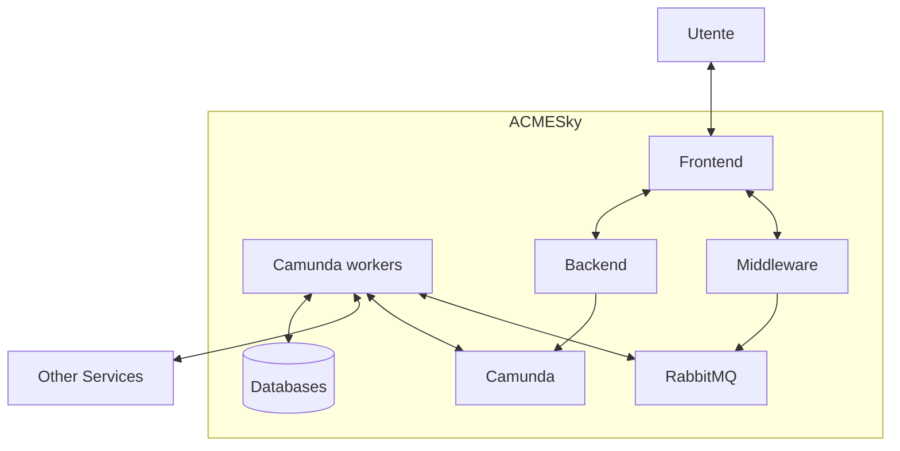
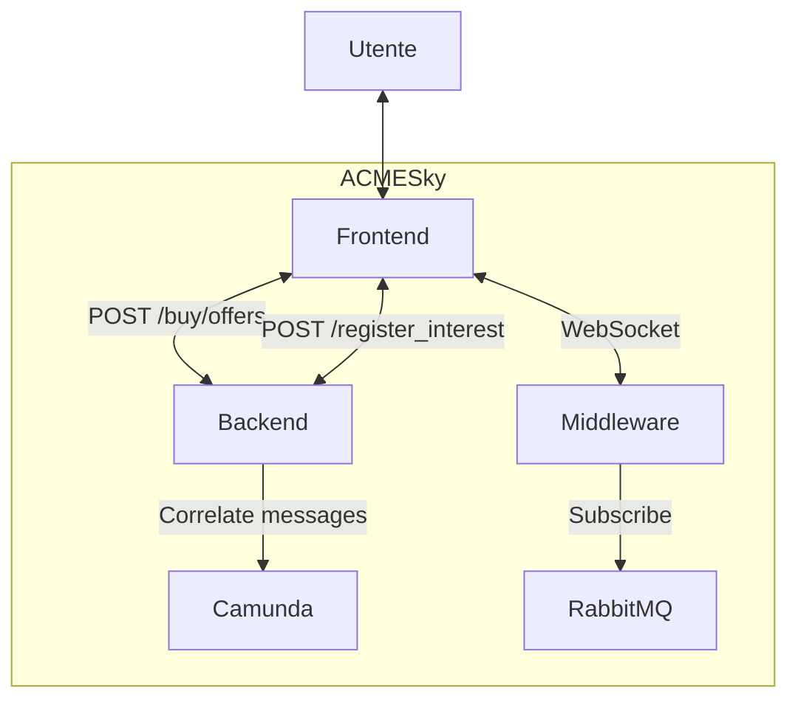
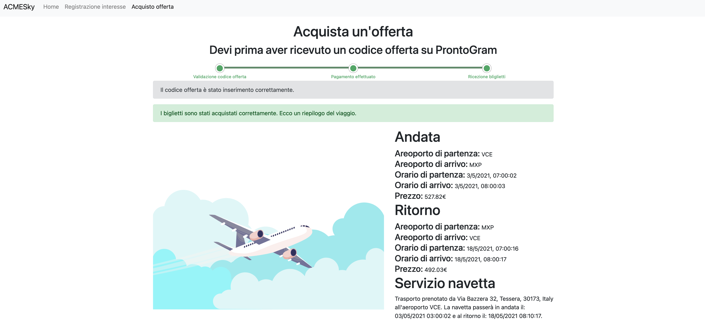
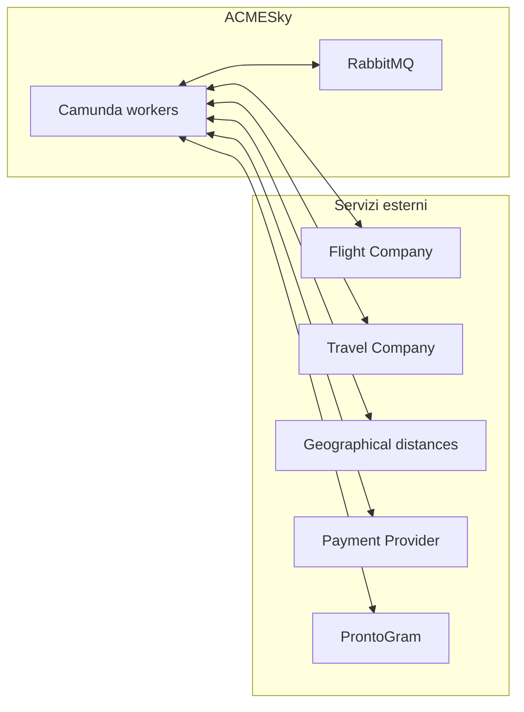
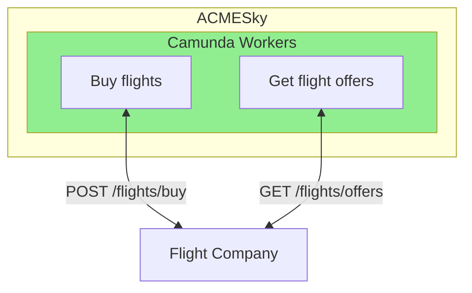
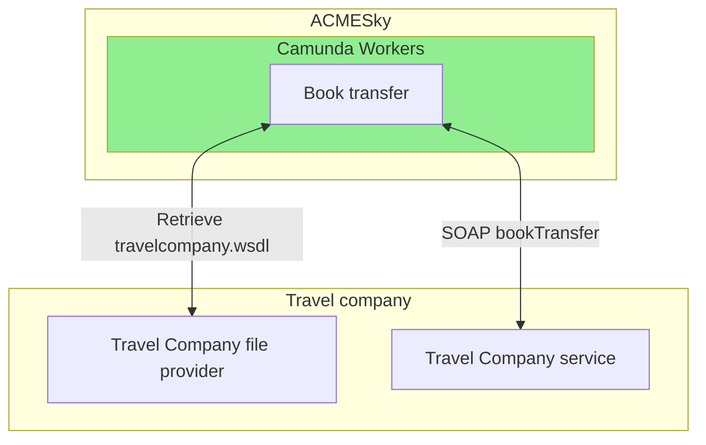
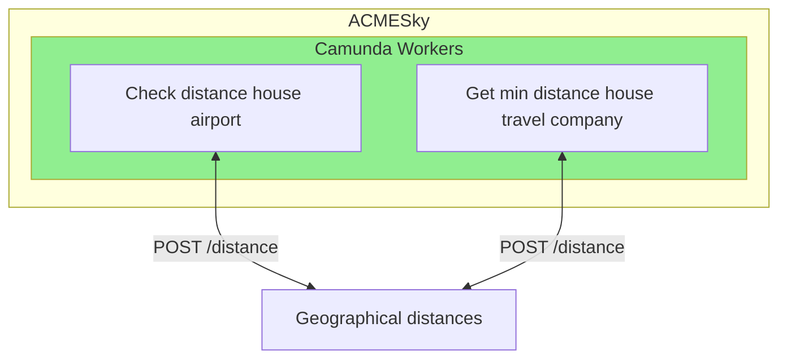

Torna a [Implementazione](../implementazione.md).

## Panoramica



ACMESky è quell'insieme di componenti che permettono ad un utente di inserire un proprio interesse all'interno del sistema e di acquistare i voli per un viaggio.

### Interazioni Utente e ACMESky


L'utente interagisce con l'interfaccia Web messa a disposizione dal Frontend. Il Frontend mette a disposizione due funzionalità, l'aggiunta di un nuovo interesse e l'acquisto di un viaggio. Queste due operazioni sono permesse da due chiamate HTTP al Backend di ACMESky: `POST /registe/interest` e `POST /buy/offers`.


#### Aggiunta di un nuovo interesse


Un utente per aggiungere il proprio interesse inserisce i dati richiesti e preme il pulsante "Conferma". Il backend a sua volta manda un messaggio a Camunda contenente i dati inseriti dall'utente avviando così un nuovo processo nell'engine i cui task verranno svolti da alcuni worker. Un task aggiunge l'interesse all'interno di mongoDB, questo database verrà riconttato quando verranno controllati gli interessi non ancora soddisfatti alla ricerca di offerte che matchano i requisiti salvati.

#### Acquisto di un'offerta


Quando un utente riceve il codice offerta tramite ProntoGram si può recare su questa pagine e, riempiendo il form con i dati richiesti avviare il processo di acquisto di un'offerta. Il Frontend contatta il Backend passandogli i dati inseriti dall'utente e, a sua volta, invia un messaggio a Camunda che avvia un nuovo processo. Il backend risponde con il codice che verrà usato per la comunicazione tra Frontend e Middleware tramite WebSocket. Quando un worker deve comunicare con il frontend pubblica un messaggio sulla coda RabbitMQ utilizzando lo stesso codice comunicato al Frontend e il Middleware, essendosi sottoscritto alla stessa coda utilizza il WebSocket per comunicare il messaggio al giusto utente.

In questo modo è possibile comunicare errori:


Richiedere il pagamento da parte dell'utente:


E mostrare l'offerta acquistata:


### Interazioni ACMESky e servizi esterni

Per poter compiere i diversi task, i worker contattano dei servizi che sono esterni ad ACMESky



Per interagire con i servizi RESTful esterni è stata utilizzata la libreria [Requests](https://pypi.org/project/requests/) che permette in maniera molto semplice di soddisfare la necessità di fare chiamate HTTP `POST` e `GET`

```
get_response = requests.get(url)
post_response = requests.post(url, json=dict_representing_the_json)
```

#### Flight Company


ACMESky comunica con le Flight Company tramite chiamate HTTP. Quando devo effettuare l'acquisto di uno o più voli invia un JSON all'endpoint `POST /flights/buy` mentre, una volta al giorno contatta l'endpoint `GET /flights/offers` per ottenere la lista di voli aggiunti nelle ultime 24h.

#### Travel Company



Quando ACMESky deve prenotare il trasferimento da/verso casa dell'utente e aeroporto utilizza la libreria [Zeep](https://docs.python-zeep.org/en/master/index.html) che è in grado di generare un client SOAP a partire dal file WSDL che descrive il servizio.

```
soap_client = Client(wsdl=wsdl_url)
soap_response = soap_client.service.buyTransfers(
            departure_transfer_datetime=outbound_departure_transfer_datetime.strftime("%Y-%m-%dT%H:%M:%S"),
            customer_address=str(offer_purchase_data.address),
            airport_code=offer_match.outbound_flight.departure_airport_code,
            customer_name=f"{offer_purchase_data.name} {offer_purchase_data.surname}",
            arrival_transfer_datetime=comeback_arrival_transfer_datetime.strftime("%Y-%m-%dT%H:%M:%S"))
```

#### Geographical distances


ACMESky utilizza il servizio per il calcolo delle distanze geografiche per calcolare la distanza tra due indirizzi. Il servizio è contattato due volte: quando c'è da calcolare la distanza tra la casa del cliente e l'aeroporto e per trovare la compagnia di trasporto più vicina alla casa del cliente.

#### Payment Provider

#### ProntoGram

Torna a [Implementazione](../implementazione.md).
