Torna a [Implementazione](../implementazione.md).

## Panoramica

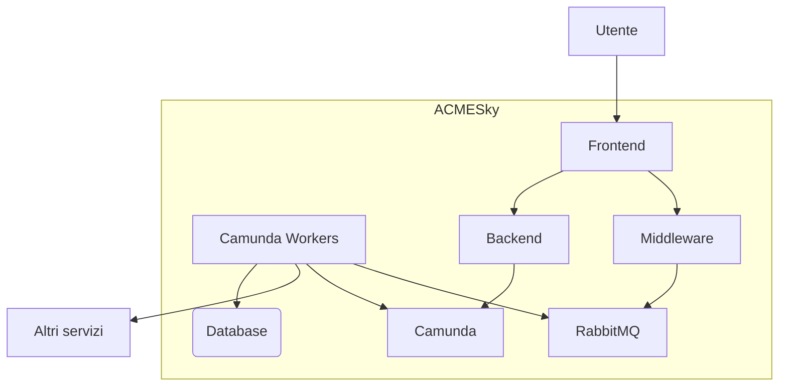

*ACMESky* è l'insieme di servizi che permettono ad un utente di inserire un proprio interesse all'interno del sistema e di acquistare i voli per un viaggio.

## Interazioni Utente e ACMESky
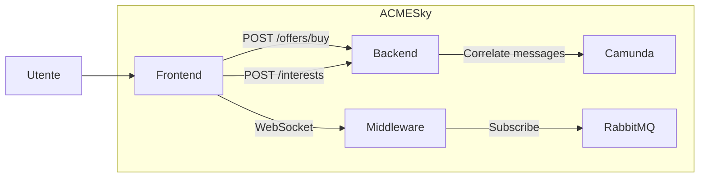

L'utente interagisce con l'interfaccia web messa a disposizione dal frontend. Il frontend mette a disposizione due funzionalità, l'aggiunta di un nuovo interesse e l'acquisto di un viaggio. Queste due operazioni sono permesse da due chiamate HTTP al backend di *ACMESky*: [POST /interests](../serviziweb/acmesky.md#registerInterest) e [POST /offers/buy](../serviziweb/acmesky.md#buyOffer).
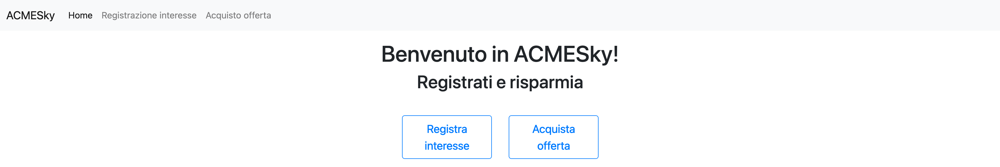

### Aggiunta di un nuovo interesse

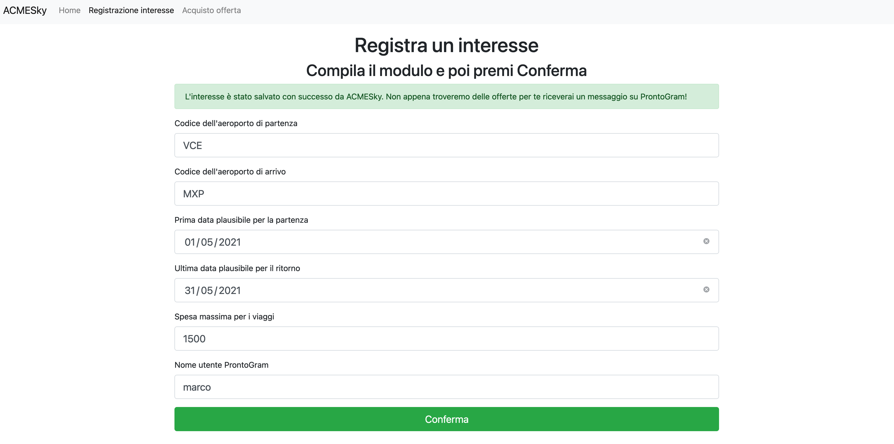

Un utente per aggiungere il proprio interesse inserisce i dati richiesti e preme il pulsante "Conferma". I dati del modulo vengono inviati al backend che, a sua volta, li invia a Camunda, avviando così una nuova istanza del business process [Registrazione interesse utente](../bpmn.md#registerInterest) nell'engine; i cui task verranno svolti dai worker assegnati, tra i quali il worker `register-interest`, che aggiunge l'interesse all'interno di MongoDB. Verrà fatto nuovamente riferimento a questo database quando verranno controllati gli interessi non ancora soddisfatti alla ricerca di offerte che soddisfano i requisiti salvati.

### Acquisto di un'offerta

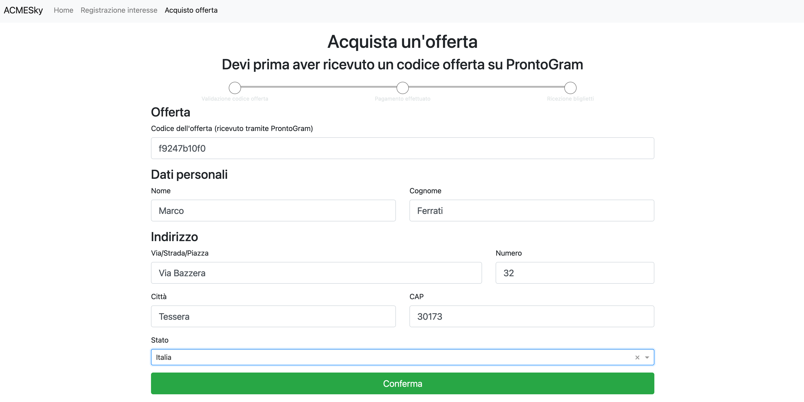

Quando un utente riceve il codice offerta tramite *ProntoGram* si può recare su questa pagine e, riempiendo il form con i dati richiesti, avviare il processo di acquisto di un'offerta. Il frontend contatta il backend passandogli i dati inseriti dall'utente e, a sua volta, invia un messaggio a Camunda che avvia una nuova istanza del processo di business [Acquisto offerta da un utente](../bpmn.md#buyOffer). Il backend risponde con il codice che verrà usato per la comunicazione tra frontend e middleware tramite WebSocket. Quando un worker deve comunicare con il frontend, pubblica un messaggio sulla coda RabbitMQ utilizzando lo stesso codice comunicato al frontend. Il middleware, essendosi sottoscritto alla stessa coda, utilizza il WebSocket per comunicare il messaggio al giusto utente.

In questo modo è possibile:

- comunicare errori:
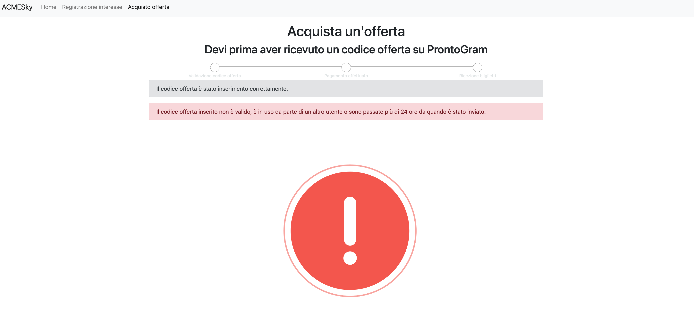

- richiedere il pagamento da parte dell'utente:
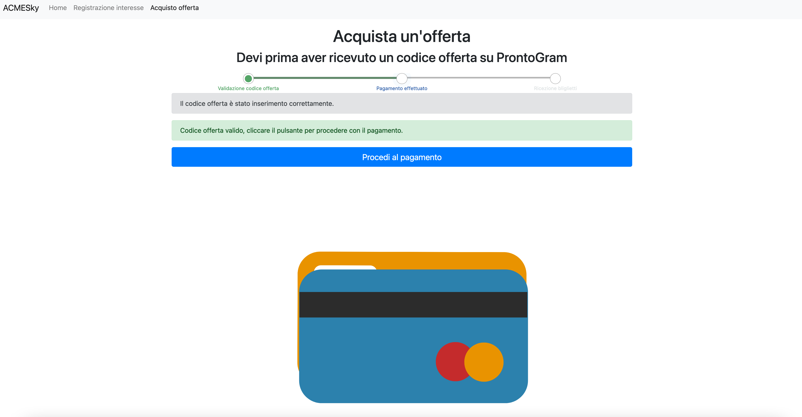

- mostrare l'offerta acquistata:


## Interazioni ACMESky e servizi esterni

Per poter compiere i diversi task, i worker contattano dei servizi che sono esterni ad *ACMESky*.

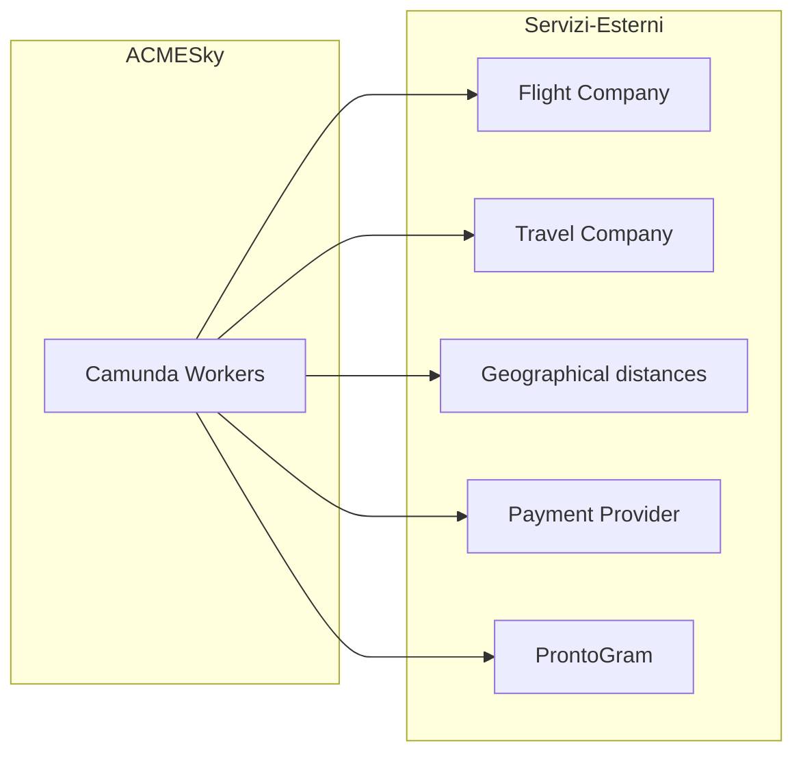

Per interagire con i servizi RESTful esterni è stata utilizzata la libreria [Requests](https://pypi.org/project/requests/) di Python che permette in maniera molto semplice di soddisfare la necessità di fare chiamate HTTP `POST` e `GET`:

```
get_response = requests.get(url)
post_response = requests.post(url, json=dict_representing_the_json)
```

### Flight Company
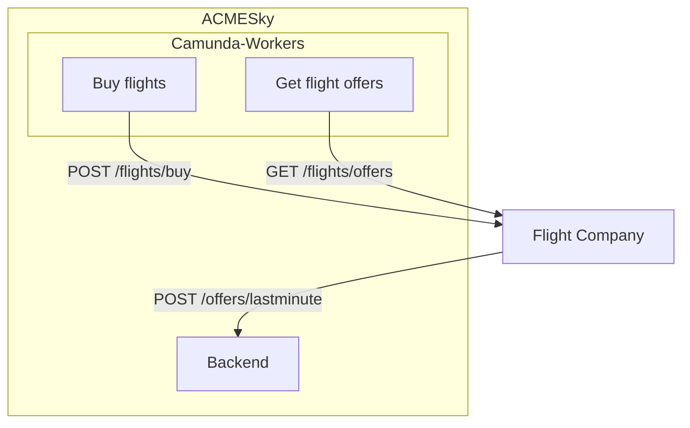

*ACMESky* comunica con le *Flight Company* tramite chiamate HTTP. Quando devo effettuare l'acquisto di uno o più voli invia un documento in formato JSON come corpo della richiesta all'endpoint [POST /flights/buy](../serviziweb/flightcompany.md#buyFlights) mentre, una volta al giorno contatta l'endpoint [GET /flights/offers](../serviziweb/flightcompany.md#getFlightOffers) per ottenere la lista di voli aggiunti nelle ultime 24h, ovvero quando Camunda avvia il business process [Verifica giornaliera delle offerte](../bpmn.md#dailyCheck)

Quando un nuovo volo viene aggiunto ad una compagnia aerea, questo viene, a sua volta, inviato anche ad *ACMESky* tramite l'endpoint [POST /offers/lastminute](../serviziweb/acmesky.md#publishLastMinuteOffer)

### Travel Company

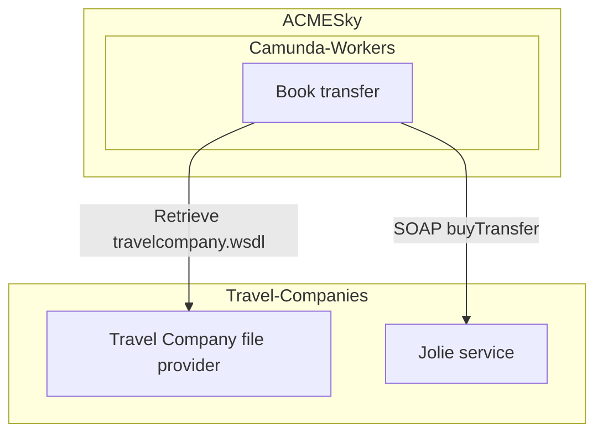

Quando *ACMESky* deve prenotare il trasferimento da/verso casa dell'utente e aeroporto utilizza la libreria [Zeep](https://docs.python-zeep.org/en/master/index.html) che è in grado di generare un client SOAP a partire dal file WSDL che descrive il servizio.

```
soap_client = Client(wsdl=wsdl_url)
soap_response = soap_client.service.buyTransfers(
    departure_transfer_datetime=outbound_departure_transfer_datetime.strftime("%Y-%m-%dT%H:%M:%S"),
    customer_address=str(offer_purchase_data.address),
    airport_code=offer_match.outbound_flight.departure_airport_code,
    customer_name=f"{offer_purchase_data.name} {offer_purchase_data.surname}",
    arrival_transfer_datetime=comeback_arrival_transfer_datetime.strftime("%Y-%m-%dT%H:%M:%S")
)
```

### Geographical distances
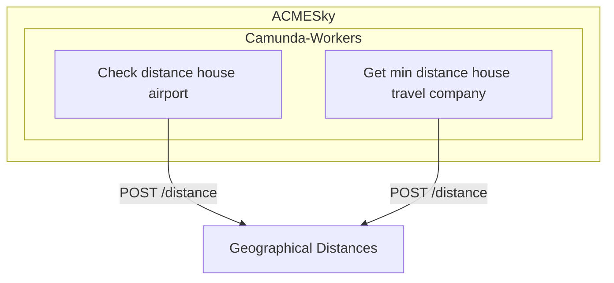

*ACMESky* utilizza il servizio per il calcolo delle distanze geografiche per calcolare la distanza tra due indirizzi. Il servizio è contattato due volte: quando c'è da calcolare la distanza tra la casa del cliente e l'aeroporto e per trovare la compagnia di trasporto più vicina alla casa del cliente.

### Payment Provider
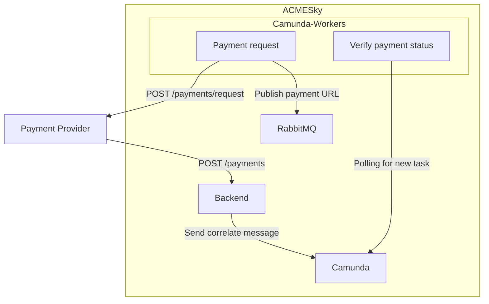

Quando un utente inserisce un codice offerta valido, il worker `payment-request` contatta il *Payment Provider* che genera una nuova istanza di pagamento e restituisce al worker il link al quale l'utente può pagare l'offerta. Il worker pubblica il link sulla coda di RabbitMQ in modo che il frontend possa ottenere il link da mostrare all'utente. 

Quando l'utente effettua il pagamento sul sito del *Payment Provider*, il suo esito viene mandato al backend di *ACMESky* all'URL indicato al momento della creazione della richiesta di pagamento; quando il backend riceve l'esito del pagamento crea un nuovo messaggio che manda a Camunda, che si occuperà di far avanzare il processo in modo che il worker `verify-payment-status` possa valutare l'esito del  pagamento appena effettuato.

### ProntoGram
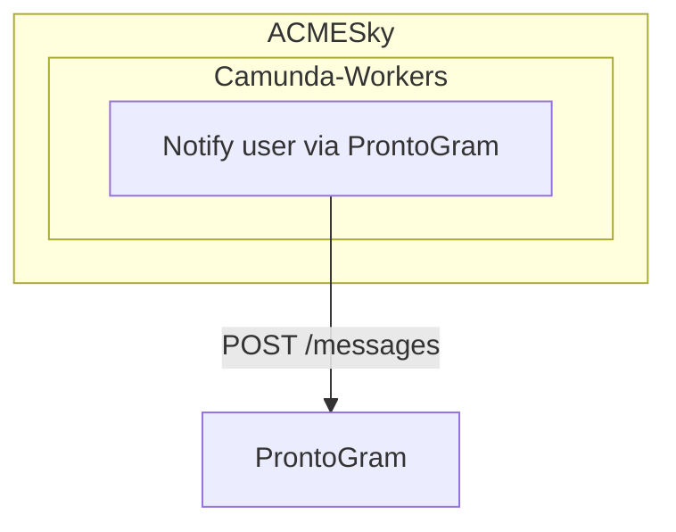

Quando viene trovata un'offerta che combacia con l'interesse da parte di un utente viene generato un "codice offerta" che viene mandato a *ProntoGram* indicando il nome utente al quale va recapitato.

Torna a [Implementazione](../implementazione.md).
