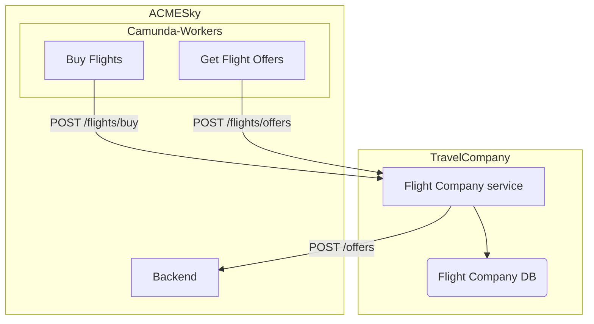

Torna a [Implementazione](../implementazione.md).

## Panoramica

*Flight Company* è il servizio che permette di acquistare il proprio biglietto per i voli della compagnia aerea, permette di ottenere una lista dei voli e notificare ad *ACMESky* la presenza di offerte last minute. L'utente non vi interagisce direttamente, in quanto qualsiasi contatto viene fatto in automatico da parte di *ACMESky*. In particolare, sono i worker `buy-flights`, `get-flight-offers` e `check-offers-presence` ad occuparsene.

Nella rete accessibile ai servizi ci sono 3 istanze di *Flight Company* (`flight_company_1`, `flight_company_2`, `flight_company_3`) che si comportano tutte nella medesima maniera.

Non essendo la parte principale di questo progetto, le *flight company* sono state implementate in maniera basilare.

Il servizio mette a disposizione due endpoint utilizzati da *ACMESky* per interagirci:

- [POST /flights/buy](../serviziweb/flightcompany.md#buyFlights) che nel corpo del messaggio contiene i voli il cui biglietto è da acquistare. La *flight company* controlla la correttezza dei dati inviati e aggiorna il record del volo nel database, incrementando il numero di biglietti acquistati ed infine ritornare l'esito dell'operazione;
- [POST /flights/offers](../serviziweb/flightcompany.md#getFlightOffers) che restituisce l'elenco dei voli disponibili nella compagnia aerea che sono stati aggiunti nelle ultime 24h.

Il database contiene la lista dei voli disponibili per la compagnia aerea, viene interrogato per ottenere i voli aggiunti nelle ultime 24h e per aggiornare il numero di biglietti venduti quando ne viene acquistato uno.

Torna a [Implementazione](../implementazione.md).
