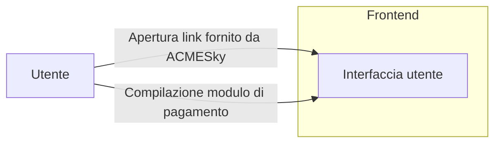
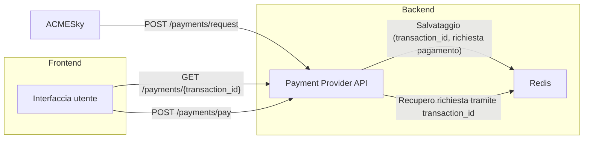
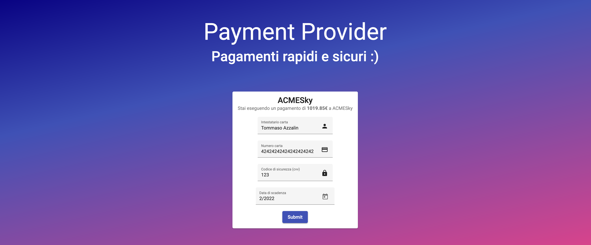

Torna a [Implementazione](../implementazione.md).

## Panoramica

*Payment Provider* è il servizio che permette:

- ad *ACMESky* di avere un intermediario per la gestione dei pagamenti delle offerte da parte dei suoi utenti;
- all'utente di pagare tali offerte tramite carta di credito.

È stato implementato in maniera semplice ma, al tempo stesso, esaustiva e il più possibile realistica, emulando quanto avviene in altri intermediari di pagamento commerciali.

Dal punto di vista di *ACMESky*, il *Payment Provider* permette di:

- creare una richiesta di pagamento, specificando chi è il ricevente del denaro (ovvero *ACMESky* stessa), l'importo e una breve descrizione per assicurare l'utente di stare pagando ciò che si aspetta;
- ricevere un URL da fornire all'utente, per permettere il pagamento, una volta aver correttamente creato la richiesta;
- essere contattato quando un pagamento viene completato, in modo da poter procedere nel processo di acquisto dell'offerta.

Dal punto di vista dell'utente, il Payment Provider permette di:

- ricevere i dettagli della richiesta di pagamento elaborata da *ACMESky* attraverso una pagina web, il cui URL, è stato precedentemente fornito ad *ACMESky*;
- inserire i dati di pagamento nella pagina sopracitata e, se sono corretti, inviare il pagamento (ovviamente il pagamento non è assolutamente reale);
- verificare il codice della carta di credito mediante la **formula di Luhn**;
- generare un errore nel pagamento nel caso il CVV inserito sia *456* (non è ovviamente né realistico né una funzionalità di interesse per l'utente, è solo un modo per permettere la generazione di errori in maniera controllata e verificare il corretto funzionamento del sistema anche in queste situazioni).

Torna a [Implementazione](../implementazione.md).
