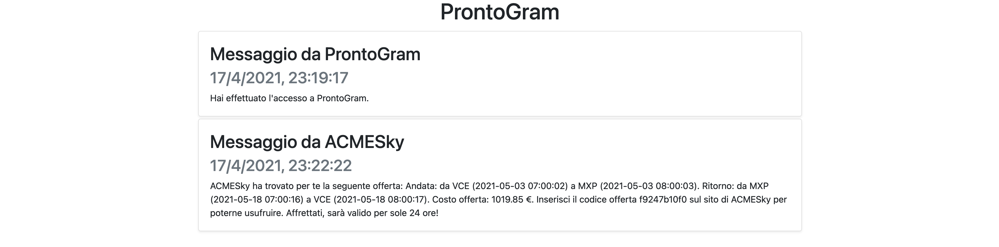

Torna a [Implementazione](../implementazione.md).

## Panoramica

*ProntoGram* è il servizio che permette agli utenti di ricevere i codici offerta sotto forma di messaggio testuale.
Gli utenti ricevono un messaggio ogni qual volta *ACMESky* trova per loro degli interessi di viaggi di cui avevano fatto richiesta.

Non essendo la parte principale di questo progetto didattico, *ProntoGram* è stato implementato in maniera molto basilare.  
In particolare, l'utente tramite questa implementazione, ha la possibilità di:

- accedere, tramite una pagina web, al servizio di messaggistica e autenticarsi mediante un **nome utente** (non vi è alcuna password richiesta);
    

- una volta che l'utente ha avuto accesso, può visualizzare tutti i messaggi che sono stati ricevuti quando non era connesso e visualizzarli in tempo reale se *ACMESky* dovesse inviargliene alcuni mentre è collegato;
- i messaggi hanno una durata temporale limitata e non vengono più memorizzati una volta visualizzati (la persistenza del messaggio dura fino alla sua visualizzazione e, da quel momento, esso viene cancellato dal supporto persistente).

Il funzionamento di *ProntoGram* dipende in larga parte dalla decisione di utilizzo del design pattern **Publish/Subscribe** e delle cosiddette **WebSocket**:

- *ACMESky*, quando ha un'offerta da comunicare ad un utente, invia un messaggio contattando l'endpoint delle API RESTful di *ProntoGram* ([POST /messages](../serviziweb/prontogram.md#sendMessage));
- ricevuta la richiesta di *ACMESky*, internamente *ProntoGram* pubblica il messaggio in una coda (*messaging queue*) fornita dal software **RabbitMQ**, avente come identificatore il ricevente indicato nel messaggio ricevuto (parte *Publish* del pattern);
- se l'utente ha avuto accesso alla pagina web di *ProntoGram* e sta visualizzando la propria lista di messaggi allora è aperta una WebSocket (implementata attraverso il software **Socket.IO**) collegata alla coda in RabbitMQ, conseguentemente il contenuto della pagina web si aggiorna automaticamente consumando il messaggio pubblicato nella WebSocket il quale, precedentemente, lo aveva consumato dalla coda RabbitMQ (parte *Subscribe* del pattern); se l'utente non ha avuto accesso allora il messaggio persiste nella coda di RabbitMQ fino al suo consumo, come descritto in precedenza.

Torna a [Implementazione](../implementazione.md).
