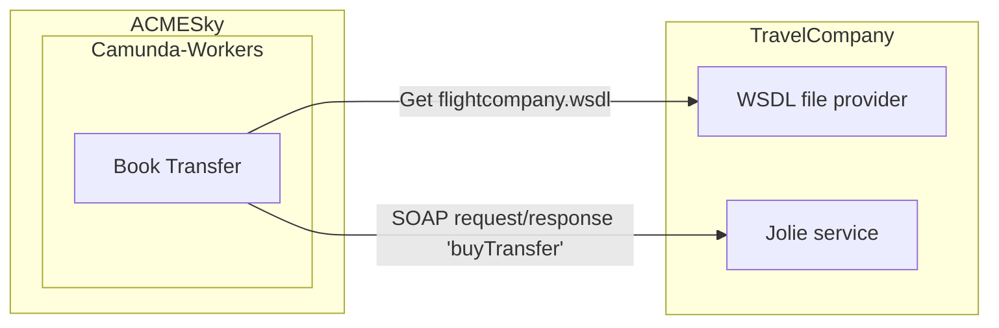

Torna a [Implementazione](../implementazione.md).

## Panoramica

*Travel Company* è il servizio che permette di prenotare il trasposto da/verso l'aeroporto e la casa del cliente. L'utente non vi interagisce direttamente in quanto qualsiasi contatto viene fatto in automatico da parte di *ACMESky*, in particolare è il worker `book-transfer` ad occuparsi di questo task. 

Nella rete accessibile ai servizi vi sono 3 istanze di *Travel Company* (`travel_company_1`, `travel_company_2`, `travel_company_3`) che si comportano tutte nella medesima maniera.

Non essendo la parte principale di questo progetto didattico, le *Travel Company* sono state implementate in maniera molto basilare.

Il container Docker che contiene i servizi espone anche il file WSDL che descrive il servizio in modo da poterci interagire tramite protocollo SOAP.

Dal punto di vista di *ACMESky*, le *Travel Company* permettono di prenotare il trasferimento di andata e ritorno dalla casa del cliente all'aeroporto. La *Travel Company* controlla che le date di andata venga prima di quella di ritorno e, se non ci sono errori, restituisce un messaggio che certifica che i trasferimenti sono stati prenotati correttamente.

Torna a [Implementazione](../implementazione.md).
