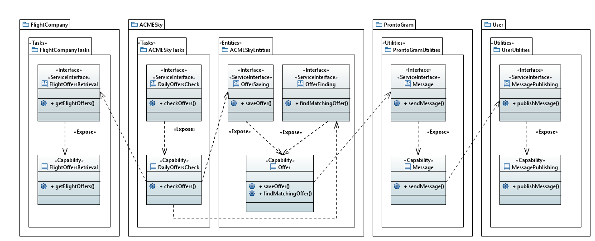

---
hide:
  - navigation
---

In questa sezione vengono rappresentata, sotto forma di diagrammi UML con profilo **TinySOA**, la modellazione della SOA di cui fa parte l'organizzazione ACMESky. I seguenti diagrammi hanno lo scopo di evidenziare di ogni servizio quali sono le *capability* accessibili tramite il sistema e le interfacce che le espongono, esternamente e/o internamente, da ogni organizzazione facente parte della SOA.  
In particolare, si distinguono tre tipi di servizi:

- **Task** (o **Process**): espone *capability* realizzate attraverso processi interni all'organizzazione, eventualmente svolti da umani. Sono strettamente legati al dominio del problema;
- **Entity**: corrisponde a una singola attività, solitamente automatica (per esempio, il salvataggio di un record in una base di dati);
- **Utility**: come i Task, ma non sono prettamente legati al dominio del problema.

## Registrazione interesse di un utente
{: loading=lazy}

## Verifica giornaliera delle offerte
{: loading=lazy}

## Ricezione offerte last minute
{: loading=lazy}

## Acquisto offerta da un utente
{: loading=lazy}
