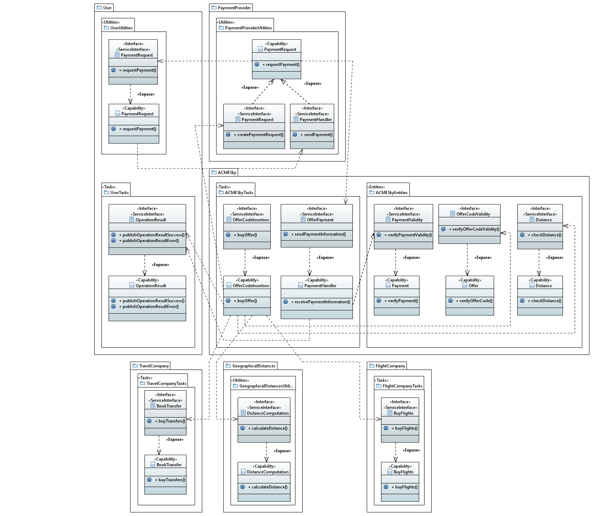

---
hide:
  - navigation
---

## Registrazione interesse di un utente
{: loading=lazy}

## Verifica giornaliera delle offerte
{: loading=lazy}

## Ricezione offerte last minute
{: loading=lazy}

## Acquisto offerta da un utente
{: loading=lazy}
