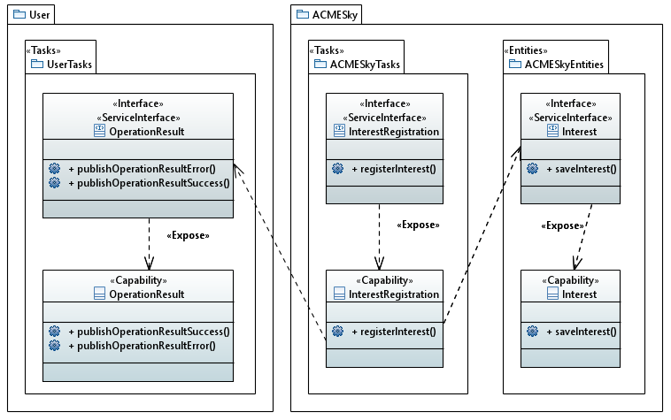

---
hide:
  - navigation
---

In questa sezione vengono rappresentata, sotto forma di diagrammi UML con profilo **TinySOA**, la modellazione della SOA di cui fa parte l'organizzazione ACMESky. I seguenti diagrammi hanno lo scopo di evidenziare per ogni servizio quali sono le *capability* accessibili tramite il sistema e le interfacce che le espongono, esternamente e/o internamente, da ogni organizzazione facente parte della SOA.  
In particolare, si distinguono tre tipi di servizi:

- **Task** (o **Process**): espone *capability* realizzate attraverso processi interni all'organizzazione, eventualmente svolti da umani. Sono strettamente legati al dominio del problema;
- **Entity**: corrisponde a una singola attività, solitamente automatica (per esempio, il salvataggio di un record in una base di dati);
- **Utility**: come i Task, ma non sono prettamente legati al dominio del problema.

## Registrazione interesse di un utente
{: loading=lazy}

Nel diagramma sovrastante sono evidenziate le capability emerse dall'analisi del diagramma BPMN "Registrazione interesse utente" e le interfacce che le espongono.

Le capability emerse, per il ruolo di ACMESky sono: _Interest_ e _InterestRegistration_. Queste due capability sono esposte mediante due interfacce e la capability _InterestRegistration_ dipende dall'interfaccia che espone la capability _Interest_. Queste due capability permettono al sistema di recepire l'interesse da parte di un utente per un viaggio e salvarlo in maniera da poterlo riutilizzare per successivi controlli. 

Inoltre, dal diagramma BPMN è emersa anche un'altra capability, questa volta relativa all'utente: _OperationResult_. Questa capability permette all'utente di recepire il successo o il fallimento dell'inserimento del suo interesse all'interno del sistema. L'interfaccia che espone quest'utlima capability è una dipendenza della capability _InterestRegistration_.

## Verifica giornaliera delle offerte
{: loading=lazy}

## Ricezione offerte last minute
{: loading=lazy}

## Acquisto offerta da un utente
{: loading=lazy}

Nel diagramma sovrastante sono evidenziate le capability emerse dall'analisi del diagramma BPMN "Acquisto offerta da un utente" e le interfacce che le espongono. 

Le capability emerse per il ruolo di ACMESky sono: _OfferCodeInsertion_, _PaymentHandler_, _Payment_, _Offer_ e _Distance_; ognugna di queste capability è esposta da una specifica interfaccia. Queste capability permettono al sistema di: ricevere la richiesta di acquisto di un'offerta da parte di un utente, ricevere l'esito di un'operazione di pagamento, verificare l'esito di un pagamento, verificare il codice dell'offerta inserito da un utente e controllare la distanza geografica tra due coordinate. La capability _OfferCodeInsertion_ dipende dalle interfacce che espongono la capability _Offer_ per poter verificare la validità del codice inserito e _Distance_ per controllare la distanza tra la casa dell'utente e l'aereoporto. La capability _PaymentHandler_ dipende dal'interfaccia che espone la capability _Payment_ per verificare l'esito del pagamento. 

Per il ruolo di PaymentProvider abbiamo individuato la capability _PaymentRequest_ esposta da due interfacce _PaymentRequest_ e _PaymentHandler_. L'interfaccia _PaymentRequest_ è una dipendenza della capability _OfferCodeInsertion_ per poter creare la richiesta di un pagamento da richiedere poi all'utente. 

Le capability emerse per il ruolo di User sono: _PaymentRequest_ e _OperationResult_ ognuna esposta da un interfaccia specifica. L'interfaccia di _PaymentRequest_ è una dipendaza della capability _PaymentRequest_ del ruolo _PaymentProvider_ per permettere al provider di pagamenti di richiedere all'utente i dati per effettura un pagamento; a sua volta la capability _PaymentRequest_ è una dipendenza dell'interfaccia _PaymentHandler_ per poter interagire con il provider di pagamento. Un ulteriore capability associata al ruolo di User è _OperationResult_ la quale permette all'utente di ricevere messaggi di successo o di errore da parte di altri ruoli; infatti l'interfaccia che espone tale capability è una dipendenza della capability _OfferCodeInsertion_ e _PaymentHandler_ di ACMESky.

Il ruolo TravelCompany possiede la capability BookTransfer e, l'interfaccia che la espone è una dipendenza di _OfferCodeInsertion_ per poter prenotare il servizion di traporto in caso l'utente ne abbia diritto.

Il ruolo GeographicDistance possiede la capability _DistanceComputation_ e, come per la precedente, l'interfaccia che la espone è una dipendenza di _OfferCodeInsertion_ per poter calcolora la distanza tra due punti geografici.

Infine, il ruolo FlightCompany ha la capability _BuyFlights_ la cui interfaccia è dipendenza di _OfferCodeInsertion_ per permettere ad ACMESky ti acquistare i voli di interesse per l'utente.
